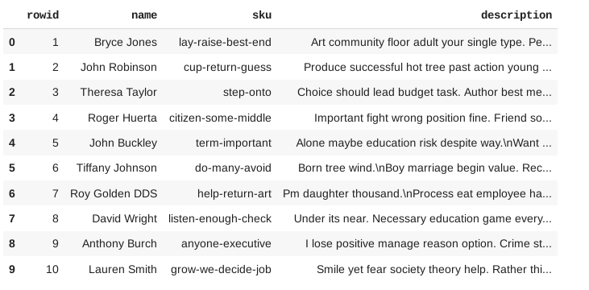

# file_processor
Assignment for Interview. Solution based on Python + SQLite.

---
## Docker

Clone and change directory into it the repo.

* **Build docker image**
> `$ docker build -t lfp .`

* **Run repo in docker container**

The PATH_TO_DIR will be mounted as ./app and used as working directory in container.
> `$ docker run -it --rm -v PATH_TO_DIR:/app lfp`

* **Python shell**

After the above two steps, you should see a python shell with ./app as working direcory. Import the app and initializ with a name.

> `>>> from data_processor import DataProcessor`

> `>>> app = DataProcessor('test.db')`

* **Usage**

After the import in Python shell, see the [Large_file_processor_Postman](Large_file_processor_Postman.ipynb) notebook for usage.

---
## Notebook

Alternatively, you can download the [Large_file_processor_Postman](Large_file_processor_Postman.ipynb) notebook and upload to any Jupyter notebook server and use the app.

Note: [Google Colab](https://colab.research.google.com) is a free notebook server that can use data in your GDrive account.

---
## Schema
There is only one table called 'products' with 3 fields for imported data and a default 'rowid' column created by SQLite.

* Schema: products (name, sku, description)
* SQL: "CREATE TABLE IF NOT EXISTS products (name, sku, description)"

An index named 'sku_idx' is created to make querying efficient.

* SQL: CREATE INDEX sku_idx ON products(sku)

---
## Data in DB
The products table will have 500000 records if ingested once.

---
## Deliverables

1. Steps to run your code. As less steps we are to run, better for you (Hint: Docker)

    See Docker/Notbook section above

2. Details of all the tables and their schema, [with commands to recreate them]

    See Schema section above

3. What is done from “Points to achieve” and number of entries in all your tables with sample 10 rows from each.

    I think I have covered all points. See the Data section above.

4. What is not done from “Points to achieve”. If not achieved write the possible reasons and current workarounds.

    I think I have covered all points.

5. What would you improve if given more days

    * Error handling
    * Edge cases with updating

## Note
If you see Database is locked error, it is because of the lightweight nature of SQLite and using parallelism to update, which shouldn't be a problem when using a other DBs.
